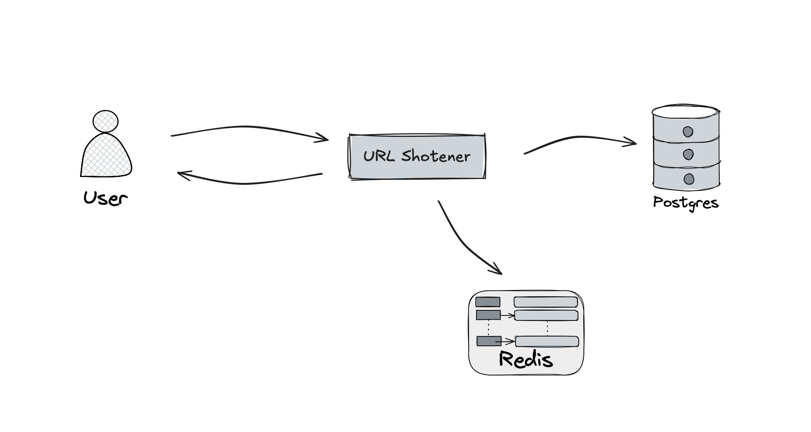
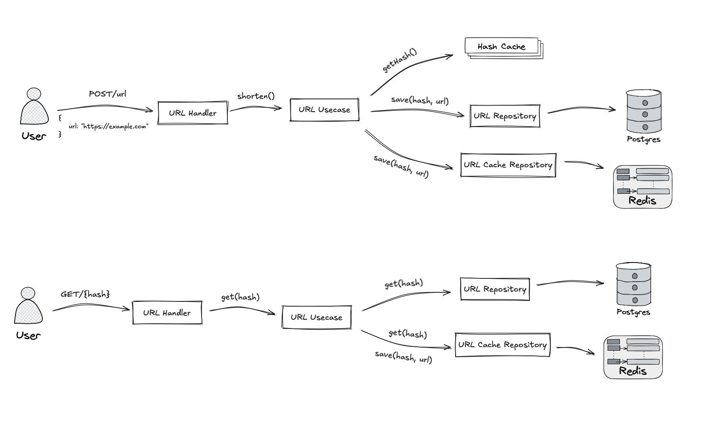
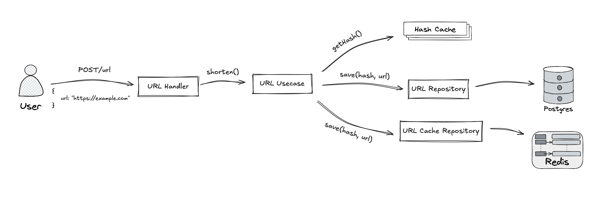
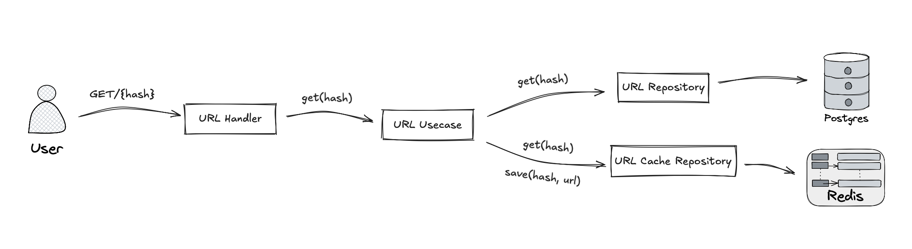
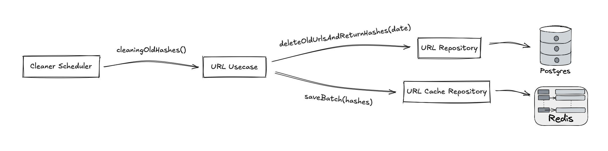
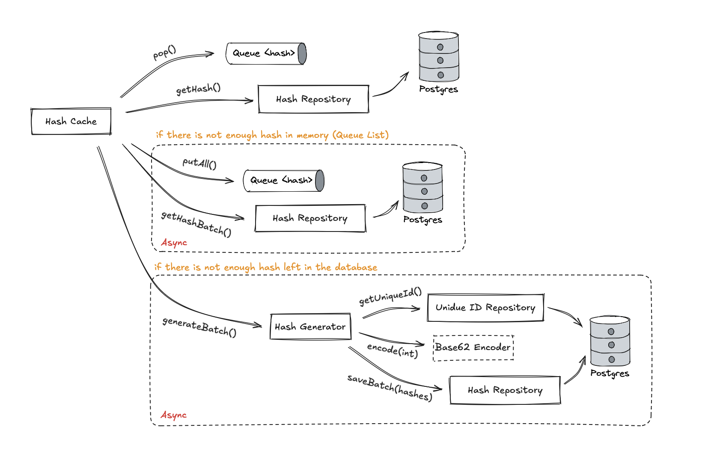

brew install golang-migrate

go install -tags 'postgres' github.com/golang-migrate/migrate/v4/cmd/migrate@latest

go get github.com/sirupsen/logrus

go get github.com/lib/pq

go get github.com/spf13/viper

go get github.com/gorilla/mux

github.com/redis/go-redis/v9

